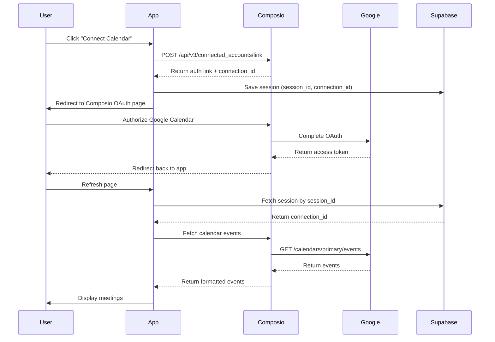

# Meeting Viewer App

A lightweight web application that connects to Google Calendar via Composio's MCP integration, fetches upcoming and past meetings, and displays them in a clean, modern interface. Built as part of the Katalyst Founding Engineer take-home assignment.


## 🚀 Live Demo

[View Live Demo →](https://calsyncapp.vercel.app)

---

## ✨ Features

### Core Features
- ✅ **Google OAuth Integration** - Secure authentication via Composio Auth Links API
- ✅ **Real Calendar Data** - Fetches 5 upcoming and 5 past meetings from Google Calendar
- ✅ **Persistent Sessions** - Supabase database integration for session storage
- ✅ **Modern UI** - Clean, responsive design with Tailwind CSS
- ✅ **Loading States** - Skeleton animations for better UX
- ✅ **Error Handling** - Graceful error messages with retry functionality
- ✅ **Expandable Details** - Click to view full meeting descriptions

### Technical Highlights
- **MCP Integration** - Uses Composio (not vanilla Calendar API) as required
- **TypeScript** - Fully typed for better developer experience
- **Next.js App Router** - Modern React framework with server components
- **Database Persistence** - Sessions survive server restarts
- **Mobile Responsive** - Works seamlessly on all devices

---

## 🛠️ Tech Stack

| Category | Technology |
|----------|-----------|
| **Framework** | Next.js 16.0.3 (App Router) |
| **Language** | TypeScript |
| **Styling** | Tailwind CSS |
| **Calendar Integration** | Composio MCP (v3 API) |
| **Database** | Supabase (PostgreSQL) |
| **Data Fetching** | SWR |
| **Deployment** | Vercel |

---

## 📋 Prerequisites

Before running this project, ensure you have:

- **Node.js** 18.x or higher
- **npm** or **yarn** package manager
- **Composio Account** - [Sign up here](https://composio.dev)
- **Supabase Account** - [Sign up here](https://supabase.com)
- **Google Cloud Project** - For OAuth credentials (configured via Composio)

---

## 🚀 Getting Started

### 1. Clone the Repository

```bash
git clone https://github.com/yourusername/meeting-viewer-app.git
cd meeting-viewer-app
```

### 2. Install Dependencies

```bash
npm install
```

### 3. Set Up Composio

1. Go to [Composio Dashboard](https://app.composio.dev)
2. Create a new Auth Config for Google Calendar
3. Copy your **Auth Config ID** and **API Key**

### 4. Set Up Supabase

1. Create a new project in [Supabase](https://supabase.com)
2. Run this SQL in the SQL Editor:

```sql
create extension if not exists "uuid-ossp";

create table if not exists oauth_sessions (
  id uuid primary key default uuid_generate_v4(),
  session_id text unique not null,
  user_id text not null,
  connection_id text not null,
  token_data jsonb,
  created_at timestamptz default now(),
  expires_at timestamptz
);
```

3. Copy your **Project URL**, **Anon Key**, and **Service Role Key**

### 5. Configure Environment Variables

Create a `.env.local` file in the root directory:

```bash
# Base URL
NEXT_PUBLIC_BASE_URL=http://localhost:3000

# Composio Configuration
COMPOSIO_API_BASE_URL=https://backend.composio.dev
COMPOSIO_AUTH_CONFIG_ID=your_auth_config_id_here
COMPOSIO_API_KEY=your_composio_api_key_here

# Session Security
COOKIE_SECRET=your_random_secret_key_here

# Supabase Configuration
SUPABASE_URL=your_supabase_project_url
SUPABASE_ANON_KEY=your_supabase_anon_key
SUPABASE_SERVICE_KEY=your_supabase_service_role_key
```

### 6. Run the Development Server

```bash
npm run dev
```

Open [http://localhost:3000](http://localhost:3000) in your browser.

### 7. Connect Your Google Calendar

1. Click **"Connect Google Calendar"** button
2. Complete the OAuth flow via Composio
3. Close the success window
4. Refresh the page to see your meetings!

---

## 📁 Project Structure

```
meeting-viewer-app/
├── app/
│   ├── api/
│   │   ├── events/route.ts        # Fetches calendar events from Composio
│   │   └── oauth/
│   │       └── start/route.ts     # Initiates OAuth flow
│   ├── components/
│   │   └── MeetingCard.tsx        # Meeting display component
│   ├── types/
│   │   └── meeting.ts             # TypeScript interfaces
│   ├── globals.css                # Global styles
│   ├── layout.tsx                 # Root layout
│   └── page.tsx                   # Main page
├── lib/
│   └── supabase.ts                # Supabase client configuration
├── .env.local                     # Environment variables (gitignored)
├── .env.example                   # Environment template
├── package.json
├── tailwind.config.ts
└── tsconfig.json
```

---

## 🔧 How It Works

### 1. OAuth Flow (Composio Auth Links)



### 2. Data Fetching

- **Upcoming Meetings**: Fetches events from `now` onwards (max 10, displays 5)
- **Past Meetings**: Fetches events from last 6 months (max 50, displays 5 most recent)
- **Caching**: Uses SWR for client-side caching and automatic revalidation

### 3. Session Persistence

- Sessions stored in Supabase `oauth_sessions` table
- Cookie-based session management (httpOnly, secure)
- 7-day session expiration

---

## 🎨 Design Decisions

### Why Composio Instead of Google Calendar API?

- **Requirement**: Assignment specified using MCP integration, not vanilla API
- **Benefits**: Simplified OAuth, managed tokens, unified API across multiple services
- **Trade-off**: Additional dependency, but faster implementation

### Why Supabase?

- **Persistence**: In-memory storage doesn't survive server restarts
- **Scalability**: Production-ready database solution
- **Bonus Points**: Assignment specifically mentioned Supabase integration
- **Speed**: Quick setup with generous free tier

### Why 6 Months for Past Events?

- **Problem**: Google Calendar returns events in ascending order (oldest first)
- **Issue**: Without time filtering, we'd get ancient recurring events (birthdays from 2006!)
- **Solution**: Limit to last 6 months to show recent, relevant meetings
- **Trade-off**: Very old meetings won't appear, but improves UX

### UI/UX Choices

- **Premium White Theme**: Clean, professional look suitable for business context
- **Skeleton Loading**: Better perceived performance than spinners
- **Expandable Descriptions**: Keeps UI clean while allowing detail access
- **Separate Sections**: Clear visual distinction between upcoming and past meetings

---

## 🚧 Known Limitations

1. **Single Calendar**: Currently only fetches from primary calendar
2. **No Real-time Sync**: Requires manual refresh to see new events
3. **Session Cleanup**: No automatic cleanup of expired sessions
4. **No AI Summaries**: Not implemented yet (see Future Enhancements)

---

## 🔮 Future Enhancements

### Planned Features
- [ ] **AI Meeting Summaries** - OpenAI integration for past meeting summaries
- [ ] **Calendar Selector** - Choose which calendar to display
- [ ] **Date Range Filters** - Custom date ranges for past events
- [ ] **Search Functionality** - Find specific meetings
- [ ] **Export to PDF** - Generate one-pager summaries
- [ ] **Real-time Sync** - Webhook integration for live updates
- [ ] **Multi-calendar View** - Display events from multiple calendars

### Technical Improvements
- [ ] Add comprehensive test coverage (Jest, React Testing Library)
- [ ] Implement proper error logging (Sentry)
- [ ] Add rate limiting for API routes
- [ ] Optimize bundle size with code splitting
- [ ] Add session cleanup cron job

---

## 🐛 Troubleshooting

### "No connection found" Error

**Cause**: Session cookie missing or invalid

**Solution**:
1. Clear browser cookies
2. Click "Connect Google Calendar" again
3. Complete OAuth flow

### Events Not Loading

**Cause**: Composio API key invalid or Google Calendar API not enabled

**Solution**:
1. Verify `COMPOSIO_API_KEY` in `.env.local`
2. Check Composio dashboard for API key status
3. Ensure Google Calendar API is enabled in your Google Cloud Project

### Supabase Connection Error

**Cause**: Invalid Supabase credentials

**Solution**:
1. Verify `SUPABASE_URL` and `SUPABASE_SERVICE_KEY` in `.env.local`
2. Check Supabase project status
3. Ensure `oauth_sessions` table exists

---

## 📝 Development Notes

### Time Breakdown (Total: ~5-6 hours)

- **Project Setup** (30 min): Next.js + TypeScript + Tailwind
- **UI Components** (45 min): MeetingCard, layout, styling
- **API Routes** (30 min): Mock data, SWR integration
- **OAuth Integration** (90 min): Composio Auth Links, debugging
- **Real Calendar Data** (60 min): Composio v3 proxy, data transformation
- **Supabase Integration** (50 min): Database setup, session persistence
- **Documentation** (20 min): README, code comments

### Key Challenges

1. **Composio API Versioning**: Initial implementation used v1, had to migrate to v3
2. **Past Events Sorting**: Google returns oldest first, needed reverse + time filtering
3. **Session Management**: Moved from in-memory to database for persistence

---

## 📄 License

This project is created for the Katalyst Founding Engineer take-home assignment.

---

## 👤 Author

**Tanmay Raut**

- Portfolio: [Tanmay Raut](https://tanmayraut.netlify.app)
- GitHub: [@tanmayraut45](https://github.com/tanmayraut45)
- LinkedIn: [Tanmay Raut](https://www.linkedin.com/in/tanmay-raut-4ab152241)
- Email: tanmayraut0@gmail.com

---

## 🙏 Acknowledgments

- **Katalyst** - For the interesting take-home challenge
- **Composio** - For the excellent MCP integration platform
- **Supabase** - For the easy-to-use database solution
- **Vercel** - For seamless deployment

---

**Built with ❤️ for Katalyst**
